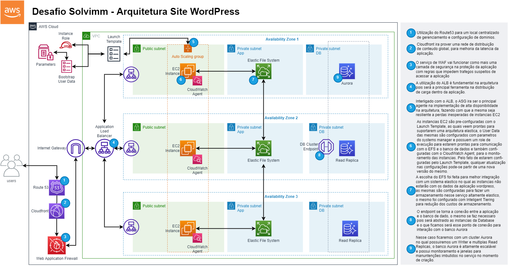

# Multi-Tier VPC with AWS Services for a WordPress Site

This repository contains the infrastructure-as-code (IaC) templates to set up a highly available, scalable, and secure WordPress site using a multi-tier Virtual Private Cloud (VPC) on AWS. The following AWS services are used:

1. VPC
2. Route 53
3. CloudFront
4. Web Application Firewall (WAF)
5. Application Load Balancers (ALB)
6. Auto Scaling Groups (ASG)
7. CloudWatch Agents
8. Elastic File System (EFS)
9. RDS Aurora (multi-AZ)

## Architecture Overview

The architecture consists of a multi-tier VPC spread across three Availability Zones (AZs) for high availability. It is designed to host a WordPress site with an emphasis on performance, security, and scalability.

1. Tier 1: The public subnet contains the Application Load Balancer (ALB) and a CloudFront distribution to handle incoming traffic.
2. Tier 2: The public subnet contains the web server instances (EC2) running WordPress. The instances are distributed across three AZs and are part of an Auto Scaling Group (ASG) for scalability and high availability. An EFS file system is used to share the WordPress content between instances.
3. Tier 3: The private subnet contains the RDS Aurora instances (multi-AZ) for database storage and management.

Route 53 is used for DNS management, while the Web Application Firewall (WAF) provides additional security by blocking malicious traffic.

